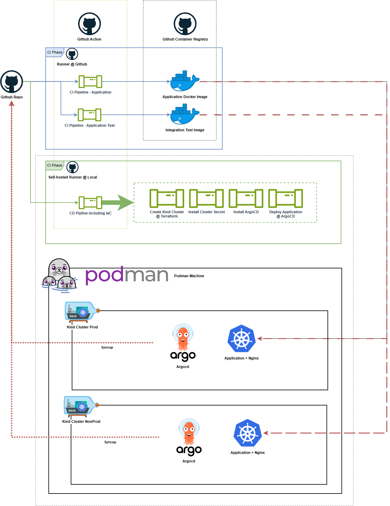

# cnjoke_bridge
A bridge to Chuck Norris jokes

Just get started [here](#get-started) if you are not interested in the trade-off journey.

## The Trade-off Journey

### 0.Challenges
- No personal public cloud resources
- No Docker Desktop
- macos @ arm64

### 1.Possibilities:

- 1.0. Existing Possible Env
   - Macbook M1 + [Podman](https://podman.io/) + [Kind - k8s in docker](https://kind.sigs.k8s.io/)
   - Windows11
   - NAS Linux/GNU Synology + Docker

- 1.1 Continous Integration
    
    - Github + Github Action + Github Container Registry

- 1.2 Continous Deployment

    TLDR; Github + Self-hosted Runner + Podman + Kind + Helm + ArgoCD

#### Tried and Tested Options

- ✅Podman/Docker compose @ macos
- ✅k8s in Kind @ macos
- ✅docker-compose @ Synology Linux
- ❌apline linux @ VirtualBox in macos arm64
- ❌apline linux @ QEMU in macos arm64
- ⚠️apline linux @ VirtualBox in Windows

#### CD Runner
  Infrastructure : ✅terraform vs ⚠️ansible
  
    -> ✅terraform kind provider!

  ⚠️Trade-off, Podman machine runs a cloud with no default external IP

  ✅Decision: Application deployment @ github self-hosted runner @ macos

##### Tried and Tested Options
  a) ✅Macos ARM64 Runner in macos

Fastest and simplest solution for this case.
```bash
  - macos
  |- github runner
  |- Podman
      |- Kind Cluster
          |- application
```

  b) ⚠️Linux ARM64 (Docker) Runner in Padman Machine

Fesible but complex setup for certificate, and runner image setup including terraform, helm, kubectl, kind etc.
```bash
  - macos
  |- Podman
      |- github runner
      |- Kind Cluster
          |- application
```

  c) ❌Linux ARM64 Docker Runner in Kind

Not feasible as a Kind Cluster is considered as part of IaC deliverable.
```bash
  - macos
  |- Podman
      |- Kind Cluster
          |- github runner
          |- application
```

-----

## Get Started

### Overall Architecture


### Quick Start
⚠️If and only if you have also same setup in macos with M1 chipset, running Podman and Kind locally.
0) Install and start Podman machine

I assuse you also use the Podman Desktop. 
Installation via `homebrew`, you might also need install `krunkit` manually if you got promt from Podman Desktop.
Then you can install Kind extension in Podman Desktop to manage Kind clusters visually.
```bash
brew install --cask podman-desktop
brew update && brew upgrade podman
brew tap slp/krunkit
brew install krunkit
```

1) Ensure your Podman machine certificate

By default, the Podman machine itself and the containerd inside has NO certificate setup.
Easiest way is to import all local certificates form macos to Podman machine and its containerd.
```bash
# Export macos certs
security find-certificate -a -p /System/Library/Keychains/SystemRootCertificates.keychain > /tmp/macos-ca.pem
security find-certificate -a -p /Library/Keychains/System.keychain >> /tmp/macos-ca.pem

# Install and update cert in Podman machine
podman machine cp <machin-name>:/etc/pki/ca-trust/source/anchors/macos-ca.pem /tmp/macos-ca.pem
podman machine ssh <machin-name>
-> root@localhost:~# sudo update-ca-trust extract
# Alternatively you can also edit a pem file in the /etc/pki/ca-trust/source/anchors/

# Install and update cert in containerd 
# It is mandatory for kubectl apply, not necessary for argocd
podman cp /tmp/macos-ca.pem <kind-cluster-name>:/usr/local/share/ca-certificates/ca.crt
# OR if you alias podman to docker
docker cp /tmp/macos-ca.pem <kind-cluster-name>:/usr/local/share/ca-certificates/ca.crt
# Need restart the container or reload ca
```

2) Install dependencies: terraform, kubectl, helm
```bash
brew tap hashicorp/tap
brew install hashicorp/tap/terraform
brew install kubectl
brew install helm
```
3) Setup local self-hosted github runner in macos

Follow the instructions in github repo to setup self-hosted runner in macos. Usually in your repo setting:
```bash
https://github.com/xpdable/cnjoke_bridge/settings/actions/runners/new
https://github.com/<your-user-id>/<your-repo>/settings/actions/runners/new
```

4) Run CI pipeline to build and push application images to Github Container Registry

CI pipeline will be triggered automatically once you push code to the repo. Both application image and integration test image will be built and pushed to Github Container Registry.

5) Run CD pipeline to deploy the application to Kind cluster in Podman

`[CD][Prod]Deploy Kind Cluster, ArgoCD, and Application` and `[CD][Non-Prod]Deploy Kind Cluster, ArgoCD, and Application` will fully roll-out and new Kind cluster.
Once it is done, you can access to ArgoCD refer to 6) and sync up the application.

6) Enjoy the Chuck Norris jokes
⚠️There is no default external IP for Kind Cluster in Podman machine, I am still working on this shit.
```bash
   kubectl get node -o wide                  1 ✘  kind-cnjoke-cluster-prod 󱃾  11:54:04
   NAME                                STATUS   ROLES           AGE   VERSION   INTERNAL-IP   EXTERNAL-IP   OS-IMAGE                         KERNEL-VERSION            CONTAINER-RUNTIME
   cnjoke-cluster-prod-control-plane   Ready    control-plane   10h   v1.33.1   10.89.0.15    <none>        Debian GNU/Linux 12 (bookworm)   6.12.7-200.fc41.aarch64   containerd://2.1.1
   cnjoke-cluster-prod-worker          Ready    <none>          10h   v1.33.1   10.89.0.14    <none>        Debian GNU/Linux 12 (bookworm)   6.12.7-200.fc41.aarch64   containerd://2.1.1
```
So the simplest way now is to forward service port to localhost:
```bash
# Port Forwarding for Nginx
kubectl port-forward svc/nginx-proxy -n xp 8888:80
# Port Forwarding for ArgoCD
kubectl port-forward svc/argocd-server -n argocd 8081:443
# Get argocd Initial Admin Password
kubectl -n argocd get secret argocd-initial-admin-secret -o jsonpath="{.data.password}" | base64 -d; echo
```
⚠️Currently the default ArgoCD application setting is auto-sync off, therefore you do need login to ArgoCD to 1st synchronize the application to deploy it to the Kind cluster.
Then you can setup auto-sync, healing as well for the next releases.

-----

### Application
With [FastAPI](https://fastapi.tiangolo.com/) python framework, a html page is rendered with a Chuck Norris joke grabbed from a public API.
The application, html template and style are in folder `app`.
Corresponding tests are in folder `tests`.

#### Features
- Get a random Chuck Norris joke
- Get a random Chuck Norris joke in selected category
- Search a Chuck Norris joke by keyword

### Application Deployment and Continuous Integration
`Dockerfile` is build for the application image.
`Dockerfile_test` is build for the application integration test image.
These two images are built and pushed to Github Container Registry in the `[CI]` pipelines.

### Infrastructure as Code and Continuous Deployment
[Terraform](https://developer.hashicorp.com/terraform) is used for IaC to deploy the application to a Kind cluster in Podman. 
[A Kind provider](https://registry.terraform.io/providers/tehcyx/kind/latest) is introduced to create and manage the Kind cluster from active terraform community.
[ArgoCD](https://argo-cd.readthedocs.io/en/stable/) is used for GitOps style deployment of the application to the Kind cluster.
ArgoCD aims to maintain the application in high availability with zero-downtime deployment strategy.
Application deployment manifests follows GitOps approach and are stored in folder `k8s-deployment`.
An ArgoCD application is created post Kind cluster creation to monitor the `k8s-deployment` folder and deploy the application to the Kind cluster.

### Secrets Management
Github access token is stored as Github secret for the CI pipeline to push images to Github Container Registry.
Correspondingly, kubernetes also need this token to pull the images from the registry.
In the CD pipeline, a kubernetes secret is created by injecting the stored Github access token.

### Version Control
Following the GitOps approach, git repo is the single source of truth for both application and infrastructure.
Therefore, the `k8s_deployment` folder indicates to the runtime version, i.e. `deployment_version`.
For CI pipeline, a `version.txt` is indicated to docker tag version, i.e. `docker_build_version`.
⚠️In this approach `deployment_version` and `docker_build_version` can be different. 

### Test Strategy
- Unittest is introduced to all CI pipelines to ensure code quality.
- Integration test is done by building a test image in job as ArgoCD post syncup hook.
The failed integration test will indicate ArgoCD to degraded status.

-----

### Improve Possibilities

#### GO TO CLOUD NATIVE !!!
#### GO TO CLOUD NATIVE !!!
#### GO TO CLOUD NATIVE !!!
Kind is ok for local simulation and play around, but not for production use as it is still somehow single-node cluster.
Also the setup is quite complex with Podman machine in macos arm64, the certificates, the hardware resource limitation setup etc.
Especially the external IP issue could be really resolved with LoadBalancer service on the cloud provider.

#### Security
The self-hosted runner locally is somehow dangerous that you expose your local machine to the internet.
This can be also resolved with cloud native solution easily. 
CI tools can be also chose to replace Github Action in the cloud.

#### Pretty Versioning and Manifesting
Think about separate the application version and infrastructure version:
- via multiple branches: each representing an environment, promotion only allowed via automation.
- via multiple repos: CI pipeline inject version to render the manifests templates to a solid ArgoCD manifest syncup url.